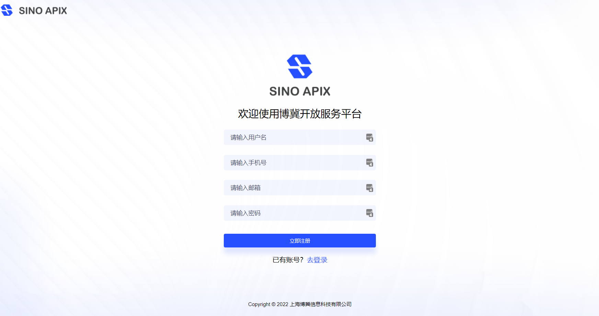
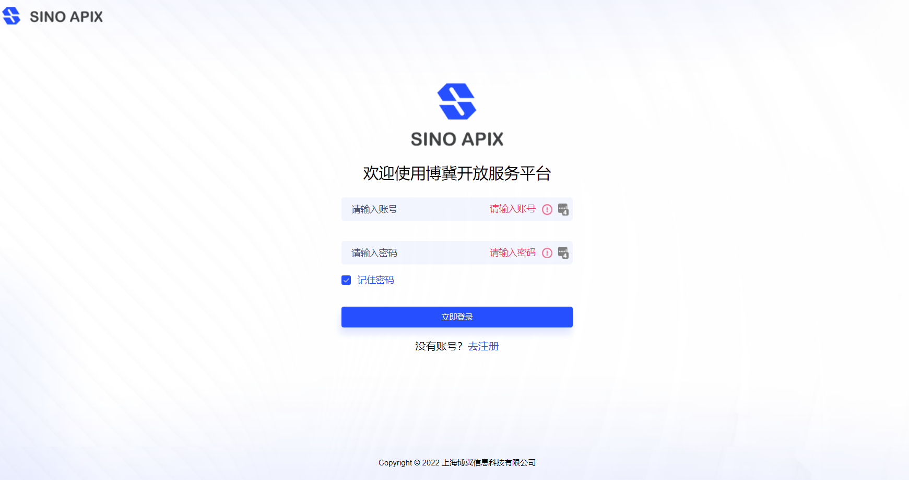
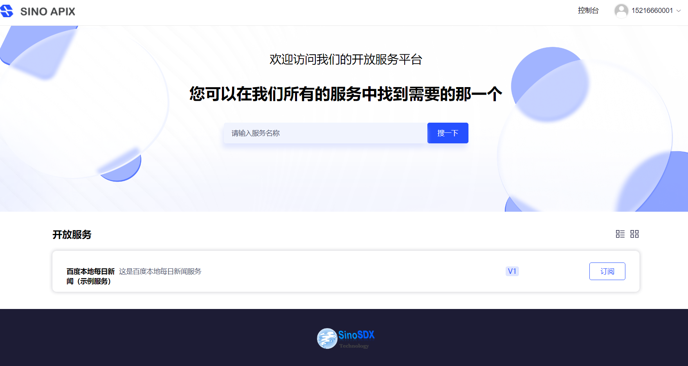
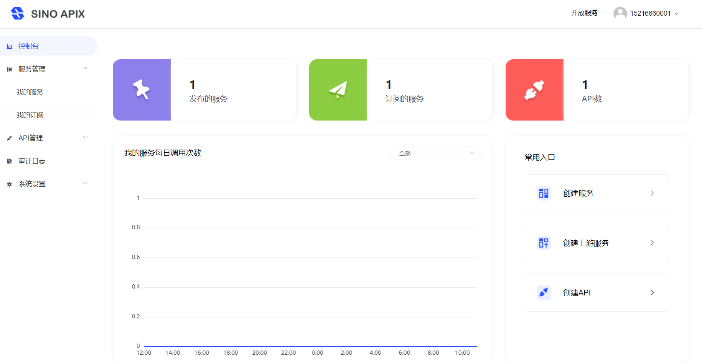
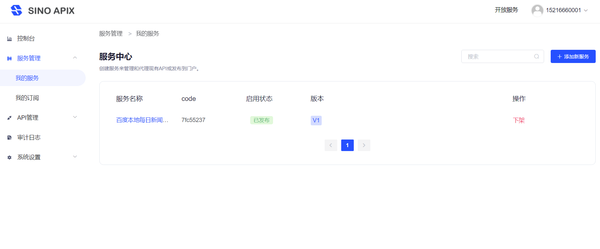
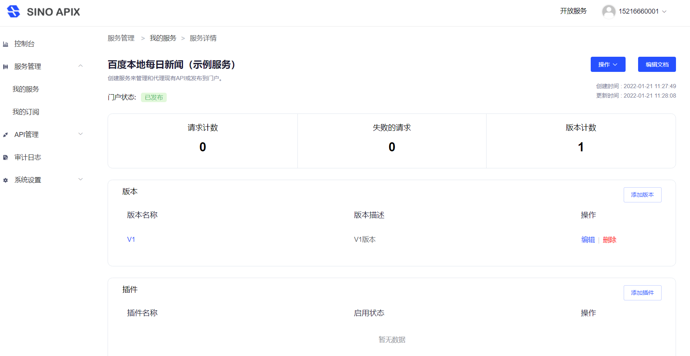
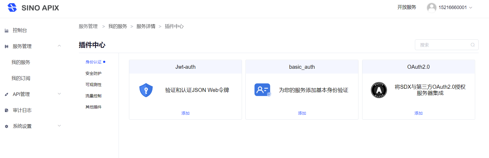
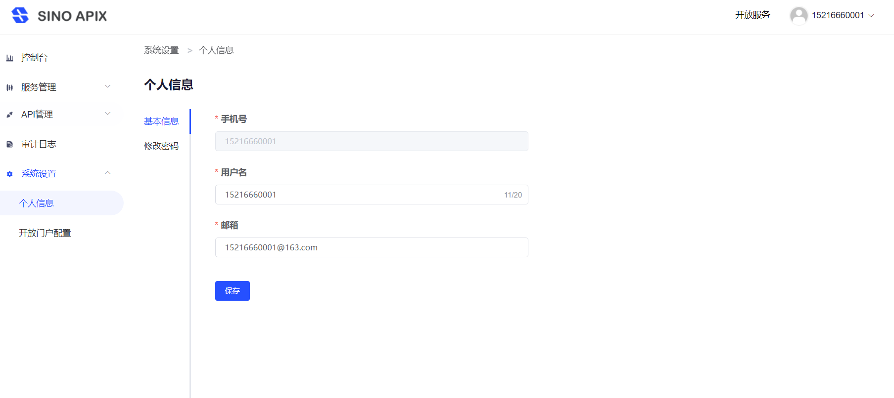
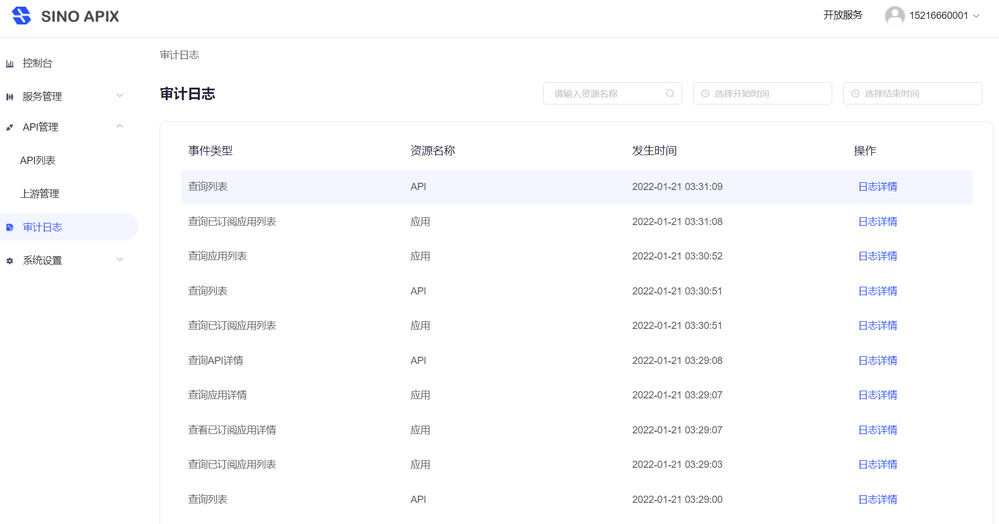

# SINO APIX 开放服务平台


## 项目简介

- SINO APIX是一款基于Java的开放服务低代码集成平台，本身基于SpringCloud、Nacous、Redis等开源框架实现。
- 本项目旨在提升很多企业应用开发者面临的应用对接效率问题，暨企业内部和外部存在大量异构应用、非标API，如何优雅的实现服务互通？
- 因此我们设计了APIX平台，希望通过低代码和自助管理的方式，快速将内部API或接口实现标准化、合规化进行发布。
  同时，企业内部或外部的服务订阅者，也能通过开发者门户，快速合规地接入企业各项应用；
- 平台后端实现了基于服务配置的动态网关、热插拔网关插件、API和服务编排聚合、动态鉴权切换、自监控报警等功能；
- 平台前端实现了2个门户，服务发布者使用控制台门户进行开放服务发布管理，服务订阅者通过开放服务门户浏览订阅所需的应用；
- SINO APIX由上海博冀信息科技有限公司 (http://www.sinosdx.com) 发布，产品研发历经2年，源自数十个项目打磨积累，服务于数家500强企业，现已部署于多个企业的私有云、混合云环境中；
- 开源版本剔除了项目定制的插件和数据源协议，保留和强化了标准化插件管理、开放门户等通用需求。今后，开源版本也将以行业泛用需求的路线进行迭代；
- 我们希望通过开源和社区化的方式，和大家一起来持续打磨这个产品，让它与更多人一起成长，也能回馈更多给开发者。


## 架构特点

- 动态发现：支持从Nacos注册中心发现后端服务器。
- 架构松耦合：业务代码实现在各自微服务上，网关不参与业务实现。
- 扩展简单：在Spring Cloud Gateway基础上进行了抽象定义实现统一，可以自定义实现自己的需求。

## 演示环境（Demo）

>测试环境地址：http://47.103.109.225:30000 
>
>账号：15216660001   Sino123456789
>
>可自助注册使用

### 模块结构
```lua
sino-apix
    └── docs                                --开发文档
        ├── deploy                          --包含多种部署方式说明（k8s、虚机、docker），及对应的sql脚本、nacos配置、启动脚本等文件
        ├── images                  
        ├── 分支管理.md              
        ├── 升级日志.md              
        ├── 自定义配置.md              
        └── 常见问题.md              
    └── apix-dependencies                --框架依赖模块                                 
        ├── parent                          --基本库，负责引入lib库版本定义、maven发布配置、环境配置等
        ├── starter-dependencies            --自定义组件依赖定义
        └── service-dependencies            --微服务依赖定义
    └── apix-client                      --客户端模块                                  
        ├── client-gateway                  --客户端调用接口SDK
        ├── client-collect-api              --客户端快速收集API push到平台SDK
    └── apix-common                      --公共模块                                 
        ├── common-base                     --基础公共类（BaseResponse、Exception、Constants...）
        └── common-gateway                  --网关公共类（用于后期支持不同类型网关）
    └── apix-core                        --框架及核心代码                            
    └── apix-gateway                     --网关模块
        ├── spring-cloud-gateway            --spring cloud gateway网关
        └── gateway-plugin                  --插件库核心代码（用于后期支持不同类型网关）                          
    └── apix-service                     --微服务集                                 
        ├── service-api-management          --管理平台服务
        ├── service-auth                    --认证授权服务
        ├── service-support-log             --日志服务
        └── service-user                    --用户服务
    └── apix-spring-boot-starter         --自定义组件模块                                
    └── apix-example                     --测试服务模块                                
        ├── demo1              
        └── demo2
    └── apix-website                     --前端工程                                
```

### 目录约定
   	示例：
   	sinosdx-middle-----------------以下目录为项目约定目录结构
        com.sinosdx.service.base
            controller
                vo-------接口实体 
            dao
                entity------db对应实体
                mapper------mapper接口目录
            service------------业务层
                dto
                bo
                impl
            configuration
                properties
            constants
            enums
            utils
            runner
### 技术栈
    需要`Java 8`环境，推荐使用`IDEA`作为开发工具，以下是所用到的技术：
    
    1. 核心框架 Spring Boot 2.4.2
    2. 微服务规范 Spring Cloud 2020.0.0
    3. 微服务框架 Spring Cloud Alibaba 2021.1
    4. API文档 Knife4j(Swagger) 2.0.1
    5. Java工具类库 Hutool 4.2.1
    6. 数据库连接池 Druid 1.1.21
    7. 持久层框架 Mybatis-plus 3.2.0
    8. Java库 Guava 28.1-jre
    9. 参数校验 Hibernate Validator 6.1.5.Final
    10. JSON序列化 Fastjson 1.2.62
    11. 代码简化插件 Lombok 1.18.12
    12. 对象属性复制工具 Mapstruct 1.3.1.Final
    13. 分布式缓存 Redis  
    14. 数据库 Mysql
    15. 服务发现/配置 Nacos 
    16. 消息队列 RabbitMQ
    17. 源码版本控制 Gitlab
    18. 项目构建框架 Maven
    19. 代码质量检测分析 SonarQube
    
## 开发环境

- Java 8，Torna要求Java版本最低为Java8
- Maven v3，包管理以及构建工具，最低版本要求maven3
- nodejs v12，前端开发需要安装nodejs，建议版本12，版本太高可能会有问题
- Mysql v5.7(推荐)
- Nacos v2.0.3(推荐)
- Redis v3.2.8

## IDEA启动
本项目采用IDEA进行开发，Eclipse理论上也能支持。

具体导入步骤如下：
- 导入sino-apix工程项目。
- 导入MySQL脚本，目录`/docs/mysql/`下四个数据库脚本文件。
- 导入Nacos脚本，目录`/docs/nacos/`下配置文件，在Nacos控制台导入即可。
- IDE安装lombok插件，然后打开项目(IDEA下可以打开根pom.xml，然后open as project)，初次导入会下载依赖包，请耐心等待
- 进入Nacos控制台，`修改common-mysql.yml`数据库配置，`修改common-redis.yml`缓存配置。
- 运行`GatewayApplication、ApplicationServiceApplication、AuthServiceApplication、UserServiceApplication、LogApplication`五个服务。
- 至此，服务端启动完毕，下面讲解运行前端工程。

运行前端:

cd website，将命令提示符跳转到front目录

- 执行`npm install`
这一步是下载nodejs相关依赖

- 执行`npm run dev`，访问`http://localhost:8080/`
至此前端启动完毕

前端请求的服务器地址配置在`.env.development`文件中，默认是`http://localhost:8080`

## QuickStart
- [基础环境搭建（参考）](docs/deploy/README.md)
- [Jar部署说明](docs/deploy/jar/README.md)
- [Docker-compose部署说明](docs/deploy/docker-compose/README.md)
- [Kubernetes部署说明](docs/deploy/kubernetes/README.md)

## 界面预览











## QA

1. 很多类缺少get/set方法？
    ```
    答：请用IDEA或Eclipse安装`lombok`插件
    ```
   
